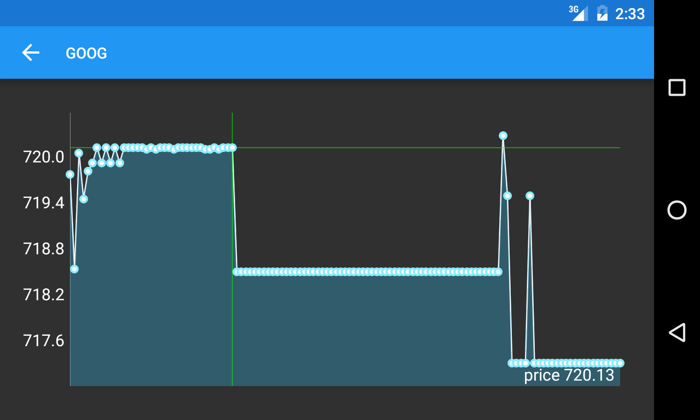
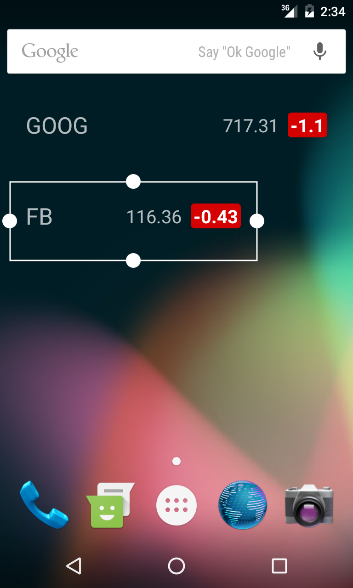
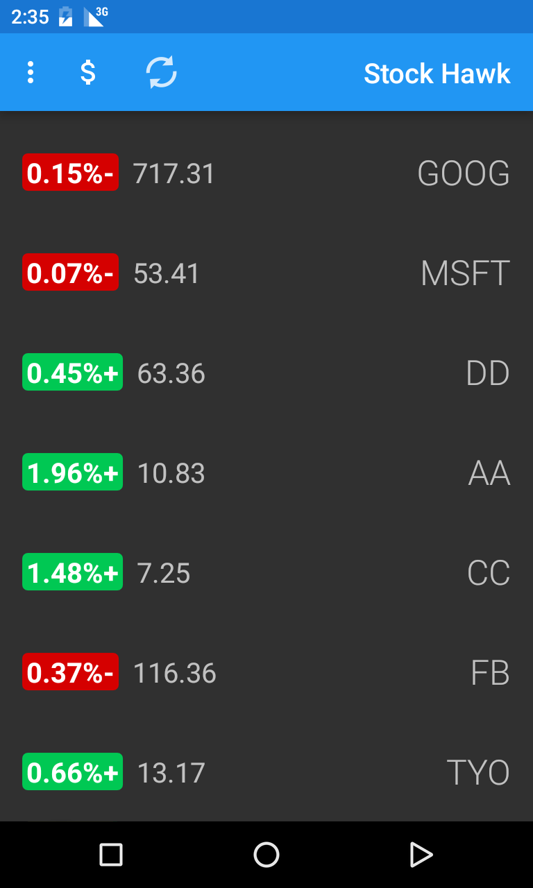

# Stock Hawk
This is my version of [stock hawk](https://github.com/udacity/StockHawk) with includes (among other
things):
- fix error cases: avoid crashes and add feedback when there is no network connectivity
- Add accessibility: programs like Talkback can read the screen contents
- Improving Localization: by adding strings that can be translated and rtl support (inverted layout
for arabic-like languages)
- Add widget support: don't need to open the app to see the stocks
- Add interactive chart: plots the price of a stock over time

### Screenshots
#### Chart

### Widget

### Rtl suport
